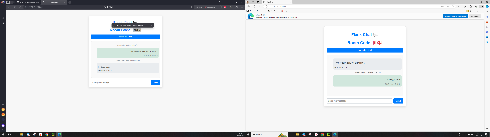

# 💬 Чат на Flask

Добро пожаловать в **Чат на Flask**! Это приложение для чата в реальном времени, которое позволяет легко создавать и присоединяться к чат-румам. Используя Flask и Flask-SocketIO, приложение поддерживает мгновенный обмен сообщениями и управление комнатами, что делает его удобным решением для быстрого общения и совместной работы.



## 🎯 Возможности

- **Создание и присоединение к чат-румам**: Генерация уникальных кодов комнат или присоединение к существующим.
- **Обмен сообщениями в реальном времени**: Отправка и получение сообщений мгновенно в любой комнате.
- **Управление комнатами**: Автоматическая обработка уведомлений о входе и выходе пользователей.
- **История сообщений**: Просмотр сообщений, отправленных до вашего присоединения к комнате.

## 🚀 Начало работы

### Предварительные требования

Убедитесь, что у вас установлено следующее:

- Python 3.8+
- `pip` (инструмент для установки пакетов Python)

### Установка

1. **Клонируйте репозиторий:**
    ```sh
    git clone https://github.com/artyoma2000/flask-chat-app.git
    cd flask-chat-app
    ```

2. **Создайте и активируйте виртуальное окружение (опционально, но рекомендуется):**
    ```sh
    python -m venv venv
    source venv/bin/activate  # Для Windows: venv\Scripts\activate
    ```

3. **Установите зависимости:**
    ```sh
    pip install -r requirements.txt
    ```

4. **Запустите приложение:**
    ```sh
    python main.py
    ```

5. **Откройте приложение в браузере:**
    ```
    http://127.0.0.1:5000
    ```

### Структура проекта

```plaintext
.
├── main.py                # Основной файл приложения
├── utilits.py             # Вспомогательные функции
├── requirements.txt       # Зависимости Python
├── templates/             # HTML-шаблоны
│   ├── base.html
│   ├── home.html
│   └── room.html
└── static/                # Статические файлы (CSS, изображения)
    ├── styles/
        └── styles.css

```

### Конфигурация

- **SECRET_KEY**: Установите безопасный ключ для управления сессиями в `main.py`.

### Создание и присоединение к комнатам

- **Создание комнаты**: Введите ваше имя и нажмите "Создать комнату". Будет сгенерирован новый код комнаты.
- **Присоединение к комнате**: Введите ваше имя и код комнаты, к которой хотите присоединиться, затем нажмите "Присоединиться".

## 🛠️ Разработка

### Полезные команды

- **Запустить приложение в режиме разработки:**
    ```sh
    python main.py
    ```

- **Обновить зависимости:**
    ```sh
    pip install --upgrade -r requirements.txt
    ```

### Будущие улучшения

- **Аутентификация пользователей**: Добавление функции входа и регистрации пользователей.
- **Эмодзи и реакции**: Интеграция эмодзи и реакции на сообщения для улучшения опыта общения.

## 🤝 Участие

Мы приветствуем вклад в улучшение этого проекта. Пожалуйста, следуйте стандартному рабочему процессу fork-branch-pull request:

1. Сделайте форк репозитория
2. Создайте новую ветку (`git checkout -b feature/your-feature`)
3. Закоммитьте ваши изменения (`git commit -am 'Добавить новую функцию'`)
4. Отправьте изменения в ветку (`git push origin feature/your-feature`)
5. Создайте новый Pull Request

## 📜 Лицензия

Этот проект лицензирован под лицензией MIT. См. файл [LICENSE](LICENSE) для подробностей.


## 📝 Благодарности

- Спасибо сообществам [Flask](https://flask.palletsprojects.com/) и [Flask-SocketIO](https://flask-socketio.readthedocs.io/en/latest/) за отличную документацию и поддержку.

Исследуйте, участвуйте и улучшайте этот проект. Приятного кодинга!

---
